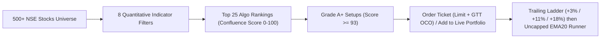

# QuantSentinel: The Complete Masterclass & System Architecture Guide
### *A Beginner-to-Advanced Guide to Quantitative Stock Market Trading, Indicators, and Algorithmic Execution*

---

> [!NOTE]
> **Who is this guide for?**
> This document is designed for **anyone**—from an absolute beginner with zero financial knowledge to an experienced market participant. It explains what the stock market is, why quantitative trading outperforms emotion-driven investing, and breaks down every single indicator and mathematical rule powering the **QuantSentinel** trading engine.

---

## Table of Contents
1. [Executive Summary: What is QuantSentinel?](#1-executive-summary-what-is-quantsentinel)
2. [Stock Market Fundamentals: How Price Actually Moves](#2-stock-market-fundamentals-how-price-actually-moves)
3. [The Psychology Trap: Why 95% of Retail Traders Lose Money](#3-the-psychology-trap-why-95-of-retail-traders-lose-money)
4. [The 8 Core Indicators of QuantSentinel (Deep Dive)](#4-the-8-core-indicators-of-quantsentinel-deep-dive)
   - [Indicator 1: 20 & 50 EMA (Stage 2 Trend Confirmation)](#indicator-1-20--50-ema-stage-2-trend-confirmation)
   - [Indicator 2: Relative Strength (RS Alpha vs Nifty 50)](#indicator-2-relative-strength-rs-alpha-vs-nifty-50)
   - [Indicator 3: Relative Volume (RVOL)](#indicator-3-relative-volume-rvol-the-institutional-footprint)
   - [Indicator 4: Relative Strength Index (RSI 14)](#indicator-4-relative-strength-index-rsi-14-the-goldilocks-zone)
   - [Indicator 5: 20-Day Resistance Breakout](#indicator-5-20-day-resistance-breakout-clearing-the-ceiling)
   - [Indicator 6: Close Location Value (CLV)](#indicator-6-close-location-value-clv-rejecting-fakeouts)
   - [Indicator 7: Average Directional Index (ADX 14)](#indicator-7-average-directional-index-adx-14-the-trend-accelerometer)
   - [Indicator 8: Extension Safety (Rubber Band Guard)](#indicator-8-extension-safety-the-rubber-band-guard)
5. [The Confluence Scoring Engine (0 to 100)](#5-the-confluence-scoring-engine-0-to-100)
6. [Risk Management & Asymmetric Payoffs ($1 : 5.2$)](#6-risk-management--asymmetric-payoffs-1--52)
7. [Algorithmic Trailing Profit Locks (Zero-Loss Defense)](#7-algorithmic-trailing-profit-locks-zero-loss-defense)
8. [The Complete Lifecycle of a QuantSentinel Trade](#8-the-complete-lifecycle-of-a-quantsentinel-trade)
9. [Strategy Modes: Conservative vs Aggressive](#9-strategy-modes-conservative-vs-aggressive)
10. [Exit Engine, Position Sizing & Market Regime](#10-exit-engine-position-sizing--market-regime)
11. [Dual Portfolios: Backtesting vs Live Desk](#11-dual-portfolios-backtesting-vs-live-desk)
12. [Dashboard, Holdings & Trade Plan Guide](#12-dashboard-holdings--trade-plan-guide)
13. [Strategy Config, Backtest Durations & Running the System](#13-strategy-config-backtest-durations--running-the-system)
14. [Quick Reference Cheat Sheet](#14-quick-reference-cheat-sheet)
15. [Glossary of Essential Terms](#15-glossary-of-essential-terms)

---

## 1. Executive Summary: What is QuantSentinel?

**QuantSentinel** is a quantitative algorithmic trading desk designed specifically for the **Indian National Stock Exchange (NSE)**. It generates ranked trade setups, simulates them historically, and tracks a real forward-money portfolio that you execute at your broker.

Instead of relying on tips, news headlines, television anchors, or human emotions (fear, greed, hope, panic), QuantSentinel operates like an institutional hedge fund:
- **Massive Universe Scanning**: After market close (15:30 IST), it scans **500+ NSE stocks** (Large Cap, Mid Cap, and Small Cap).
- **Multi-Factor Confluence**: Each stock passes through **8 mathematical indicator models**. The overwhelming majority of stocks fail these checks and are rejected.
- **Two Strategy Modes**: **Conservative** (strict institutional breakouts, roughly 40 trades per year) and **Aggressive** (broad high-frequency momentum, roughly 160-170 trades per year). See [Section 9](#9-strategy-modes-conservative-vs-aggressive).
- **Asymmetric Risk/Reward**: Every trade starts with a **-4.8% hard stop-loss** and a **+25.0% profit reference target**, a planned ratio of about 5.2 to 1.
- **Dynamic Protection**: A multi-step trailing ladder moves the stop above entry as a trade works (+1.2% at +3% peak, +5.5% at +11%, +11.5% at +18%). Beyond +25% there is no fixed cap: the stop trails the 20 EMA so big winners can run.
- **Two Isolated Portfolios**: A **Backtesting** portfolio for historical simulation and a **Live Portfolio** that starts with ₹50,000 and tracks your real trades. A header toggle switches between them. See [Section 11](#11-dual-portfolios-backtesting-vs-live-desk).



---

## 2. Stock Market Fundamentals: How Price Actually Moves

To understand QuantSentinel, you must first understand the fundamental mechanics of the stock market.

### What is a Stock?
A stock (or share) represents partial ownership in a real-world corporation (like Tata Steel, Reliance Industries, or Infosys). When a company thrives, expands, and generates increasing cash flows, its perceived value rises.

### What Makes Stock Prices Move?
At any given second, stock prices move strictly according to the economic law of **Supply and Demand**:
- If more buyers want to purchase shares than sellers want to part with them, buyers must bid higher prices $\implies$ **Price goes up**.
- If more sellers want to dump shares than buyers want to absorb, sellers must lower their asking prices $\implies$ **Price goes down**.
- When buyers and sellers are equal, price moves sideways in a range $\implies$ **Consolidation / Chop**.

### The Anatomy of a Candlestick Bar
In daily swing trading, each day's trading action is represented by a **Candlestick Bar**, which records four critical price points (**OHLC**):
1. **Open (O)**: The price at which the first transaction occurred when the market opened at 09:15 AM.
2. **High (H)**: The highest price reached at any point during the day.
3. **Low (L)**: The lowest price reached at any point during the day.
4. **Close (C)**: The final settled price when the market closed at 15:30 PM.

```
       High (Highest price of the day)
        │
    ┌───┴───┐
    │       │
    │ Body  │  If Close > Open  ==> GREEN CANDLE (Buyers won the day)
    │       │  If Close < Open  ==> RED CANDLE   (Sellers won the day)
    └───┬───┘
        │
       Low  (Lowest price of the day)
```

The difference between the High and Low is the **Candle Range**. The difference between the Open and Close is the **Candle Body**. The thin lines above and below the body are called **Wicks (or Shadows)**.

### What is Volume?
**Volume** is the total number of shares bought and sold during that day. 
- *Why Volume is Critical*: Retail traders (individuals trading from their phones) trade hundreds or thousands of shares. Institutional giants (Mutual Funds, Foreign Institutional Investors / FIIs, Domestic Institutions / DIIs) trade **millions of shares**. 
- When an institution enters a stock, they cannot hide their footprints: the volume bar spikes dramatically. QuantSentinel tracks these institutional footprints.

---

## 3. The Psychology Trap: Why 95% of Retail Traders Lose Money

Extensive academic studies by financial regulators (including SEBI in India) reveal that over **90% to 95% of retail stock traders lose money**. Why does this happen?

| Retail Trader Flaw | How Retail Loses | How QuantSentinel Solves It |
| :--- | :--- | :--- |
| **FOMO (Fear of Missing Out)** | Buys stocks after they have already rallied 40% in a week, right before institutions dump. | **Extension Safety Indicator**: Rejects any stock more than 8% above its 20 EMA. |
| **Disposition Effect** | Cuts small winning trades at +3% out of fear, but holds losing trades at -20% hoping they come back. | **Asymmetric Risk/Reward**: Cuts losses strictly at -4.8%; lets winners run to +25.0%. |
| **Catching Falling Knives** | Buys dying stocks that crashed 50% because "they look cheap". | **Stage 2 Trend Confirmation**: Only buys stocks in strong, rising upward trends. |
| **Lack of Edge / Tips** | Buys based on WhatsApp groups, Telegram channels, and TV pundits. | **8-Factor Mathematical Confluence**: Requires objective quantitative confirmation. |
| **Emotional Exhaustion** | Panics during intraday red candles and sells at the exact bottom. | **Automated GTT Bracket Orders**: Execution rules are locked in advance with zero emotion. |

---

## 4. The 8 Core Indicators of QuantSentinel (Deep Dive)

> [!NOTE]
> The thresholds quoted in this section are the **Conservative** mode values. **Aggressive** mode uses looser values for several indicators (listed in [Section 9](#9-strategy-modes-conservative-vs-aggressive)). The Algo Top 25 tab shows the criteria for whichever mode is active.

QuantSentinel evaluates every stock across **8 complementary indicator models**. Each indicator acts as a specialist filter examining a different dimension of market physics: Trend, Relative Strength, Volume, Momentum, Structure, Candlestick Pressure, Directional Velocity, and Extension Safety.

```
┌────────────────────────────────────────────────────────────────────────┐
│                   QUANTSENTINEL 8-INDICATOR MATRIX                    │
├───────────────────┬────────────────────────────────────────────────────┤
│ 1. Trend          │ 20 EMA > 50 EMA & Price >= 20 EMA (Stage 2)        │
│ 2. Alpha          │ Relative Strength Alpha >= +4.0% vs Nifty 50       │
│ 3. Volume         │ Relative Volume (RVOL) >= 1.90x 20-Day Average     │
│ 4. Momentum       │ 14-Day RSI in Sweet Spot (52.0 - 72.5)             │
│ 5. Structure      │ 20-Day Resistance High Breakout (Within 1.5%)      │
│ 6. Pressure       │ Close Location Value (CLV) >= 68% (Upper Wick Trap)│
│ 7. Velocity       │ ADX >= 20.0 (Confirmed Directional Trend)         │
│ 8. Safety         │ <= 8.0% Above 20 EMA (No Parabolic Chasing)        │
└───────────────────┴────────────────────────────────────────────────────┘
```

---

### Indicator 1: 20 & 50 EMA (Stage 2 Trend Confirmation)

#### Plain English Analogy
*Imagine swimming in a river. If you swim with the current, you glide effortlessly. If you try to swim against the current, you exhaust yourself and drown. The Moving Average represents the current of the river.*

#### What is an EMA?
An **Exponential Moving Average (EMA)** calculates the average closing price of a stock over a set number of days, but gives **exponentially higher weight to recent days**. 
- A **20 EMA** reflects the short-term institutional trend (approximately 1 month of trading days).
- A **50 EMA** reflects the medium-term structural trend (approximately 2.5 months of trading days).

```python
# Mathematical Concept
Multiplier = 2 / (Period + 1)
EMA_Today = (Price_Today * Multiplier) + (EMA_Yesterday * (1 - Multiplier))
```

#### Why We Use It (The Rationale)
According to classic market cycle theory (Stan Weinstein's Stage Analysis), stocks cycle through 4 stages:
1. *Stage 1*: Basing / Accumulation (Sideways)
2. *Stage 2*: **Advancing Phase (Strong Uptrend)** $\leftarrow$ *QuantSentinel only trades here*
3. *Stage 3*: Distribution / Top (Sideways churn)
4. *Stage 4*: Declining Phase (Downtrend crash)

When a stock's current price is above its 20 EMA, and its 20 EMA is comfortably above its 50 EMA and rising, the stock is in a confirmed **Stage 2 Uptrend**.

#### QuantSentinel Thresholds
- **Current Close $\ge$ 20 EMA**
- **20 EMA $\ge$ 50 EMA $\times 1.01$** (at least 1% clearance)
- **Slope of 20 EMA $> 0$** (must be pointing upward over the past 5 sessions)
- **Slope of 50 EMA $\ge 0$** (must not be sloping downward)

#### The Goal
**To eliminate falling knives.** This indicator guarantees that QuantSentinel will never buy a stock that is crashing, stagnating, or stuck in a downtrend.

---

### Indicator 2: Relative Strength (RS Alpha vs Nifty 50)

#### Plain English Analogy
*Imagine two racehorses. On a calm day, both run well. But when a fierce headwind starts blowing, Horse A slows down by 10%, while Horse B powers forward and gains 15% speed. Horse B possesses genuine, elite strength.*

#### What is RS Alpha?
Relative Strength (not to be confused with RSI) measures **how much a stock is outperforming the broader benchmark index (Nifty 50)** over a rolling 20-day window (1 calendar month).

$$\text{Stock Return}_{20d} = \frac{\text{Price}_{\text{today}} - \text{Price}_{20d\text{ ago}}}{\text{Price}_{20d\text{ ago}}}$$

$$\text{Nifty Return}_{20d} = \frac{\text{Nifty}_{\text{today}} - \text{Nifty}_{20d\text{ ago}}}{\text{Nifty}_{20d\text{ ago}}}$$

$$\text{RS Alpha} = (\text{Stock Return}_{20d} - \text{Nifty Return}_{20d}) \times 100$$

#### Why We Use It (The Rationale)
When the overall market (Nifty 50) drops by -2%, but a stock rises +3%, big institutional funds are actively accumulating that stock despite market fear. When the broader market finally rebounds, these "Relative Strength Leaders" explode higher with massive momentum.

#### QuantSentinel Thresholds
- **RS Alpha $\ge +4.0\%$**: The stock must have beaten the Nifty 50 index by at least 4.0% over the last 20 trading sessions.
- *Bonus Weight*: If Alpha $\ge +8.0\%$, the stock is awarded additional confluence score points.
- *Rejection*: If Alpha is negative (meaning the stock is lagging behind the market), score points are heavily penalized.

#### The Goal
**To buy only market leaders, never laggards.** We want the strongest horse in the race, not the cheapest one.

---

### Indicator 3: Relative Volume (RVOL) — The Institutional Footprint

#### Plain English Analogy
*If you see ripples in a swimming pool, a child just jumped in. If you see tidal waves sloshing over the sides of the pool, an elephant just stepped into the water. Relative Volume detects the elephant.*

#### What is RVOL?
**Relative Volume (RVOL)** compares today's trading volume to the stock's average daily volume over the past 20 sessions:

$$\text{Average Volume}_{20d} = \frac{1}{20} \sum_{i=1}^{20} \text{Volume}_i$$

$$\text{RVOL} = \frac{\text{Today's Volume}}{\text{Average Volume}_{20d}}$$

- $\text{RVOL} = 1.0\times \implies$ Perfectly normal, ordinary trading volume.
- $\text{RVOL} = 0.5\times \implies$ Light, dormant volume (only retail traders).
- $\text{RVOL} \ge 1.9\times \implies$ **Huge institutional accumulation.**

#### Why We Use It (The Rationale)
Retail traders cannot generate double the average volume in a multi-billion rupee stock. A volume surge of $1.9\times$ or higher proves that domestic mutual funds, foreign hedge funds, or sovereign wealth funds are aggressive net buyers. 

A price breakout accompanied by high volume is far less likely to fail because institutional buyers have skin in the game and will defend their purchase price.

#### QuantSentinel Thresholds
- **RVOL $\ge 1.90\times$**: Today's volume must be at least **90% higher** than the 20-day moving average.
- *High-Conviction Threshold*: Breakouts with $\text{RVOL} \ge 3.0\times$ receive maximum institutional momentum ranking points.
- *Rejection*: Any breakout occurring on $\text{RVOL} < 1.0\times$ is rejected as a "low-volume fakeout".

#### The Goal
**To ensure institutional sponsorship.** We only trade when the biggest money in the market is pushing the price in our direction.

---

### Indicator 4: Relative Strength Index (RSI 14) — The "Goldilocks" Zone

#### Plain English Analogy
*Think of the engine RPM in a sports car. If the RPM is at 1,000, the car is idling in neutral and going nowhere. If the RPM is at 8,500, the engine is redlining and about to overheat. The sweet spot is 5,500 RPM—maximum power output without blowing the engine.*

#### What is RSI?
The **Relative Strength Index (RSI)**, developed by J. Welles Wilder, is a momentum oscillator measured on a scale of **0 to 100**. It calculates the ratio of average upward price movement to average downward price movement over 14 trading days:

$$\text{RS} = \frac{\text{Average Gain over 14 days}}{\text{Average Loss over 14 days}}$$

$$\text{RSI} = 100 - \left( \frac{100}{1 + \text{RS}} \right)$$

- $\text{RSI} < 30 \implies$ "Oversold" (weak, depressed momentum).
- $\text{RSI} > 75 \implies$ "Overbought" (climax euphoria, highly vulnerable to profit taking).
- **$\text{RSI between } 52.0 \text{ and } 72.5 \implies$ The Institutional Momentum Sweet Spot.**

#### Why We Use It (The Rationale)
Traditional textbooks advise buying when RSI is below 30. In reality, stocks with RSI $< 30$ are usually broken companies experiencing severe distress. 

Conversely, strong momentum compounders initiate their biggest sustained moves when RSI crosses above 50 and powers into the 60s. However, once RSI exceeds 75, retail traders pile in with FOMO, creating a high-risk exhaustion climax where institutions dump their shares.

#### QuantSentinel Thresholds
- **Minimum RSI: $52.0$** (confirms bullish momentum has ignited).
- **Maximum RSI: $72.5$** (ensures price has not overheated).
- *Strict Hard Cap*: In live trade execution, any setup with $\text{RSI} > 76.5$ is strictly blocked to protect capital from exhaustion tops.

#### The Goal
**To enter during prime acceleration while avoiding overbought climax tops.**

---

### Indicator 5: 20-Day Resistance Breakout (Clearing the Ceiling)

#### Plain English Analogy
*Imagine bouncing a basketball under a concrete ceiling. Every time the ball hits the ceiling, it bounces back down. But if someone smashes the ceiling with a sledgehammer, the next bounce shoots straight into the open sky. A resistance breakout is smashing through that concrete ceiling.*

#### What is a 20-Day High Breakout?
A stock's **20-Day High** is the highest price recorded across the past 20 trading sessions (1 month). 
- If today's closing price exceeds that previous 20-day high $\implies$ **Bullish Breakout**.
- If today's price is within **1.5%** of that ceiling $\implies$ **Pre-Breakout Coil**.

```
Price (₹)
  120 ───────────────────────────── Concrete Resistance (20-Day High)
           /\          /\          ▲
          /  \        /  \        /│  ==> BREAKOUT OCCURS HERE!
         /    \      /    \      / │
  100 ──/──────\────/──────\────/──┴── Support Floor
```

#### Why We Use It (The Rationale)
Why is the previous high so significant? 
Because every investor who bought at that previous high was formerly trapped "in the red" as the price pulled back. When the price rallies back to that level, nervous investors often sell to "break even", creating resistance. 

When the price overcomes and closes above that level, **there are zero trapped overhead sellers left**. Every single person holding the stock is now in profit. Selling pressure vanishes, and price enters "blue sky territory" where it can run freely.

#### QuantSentinel Thresholds
- **Breakout Condition**: $\text{Close} \ge \text{Highest High of past 20 days}$, OR
- **Contraction Coil Condition**: $\text{Distance from 20-Day High} \le 1.5\%$.

#### The Goal
**To buy at the point of least resistance.** When overhead resistance is broken, price can travel the furthest distance in the shortest amount of time.

---

### Indicator 6: Close Location Value (CLV) — Rejecting Fakeouts

#### Plain English Analogy
*Imagine an army storming an enemy hill. By noon, they reach the summit. But by evening, the defenders push them all the way back down to the bottom. Did the army win the day? No. But if the army reaches the summit and holds the high ground at nightfall, they won decisive control.*

#### What is Close Location Value?
**Close Location Value (CLV)** evaluates where the stock closed within its intraday High-Low range on that specific day:

$$\text{CLV} = \frac{\text{Close} - \text{Low}}{\text{High} - \text{Low}}$$

The result is expressed between $0.0$ and $1.0$ (or 0% to 100%):
- $\text{CLV} = 1.0\ (100\%) \implies$ Price closed at the exact absolute high of the day.
- $\text{CLV} = 0.5\ (50\%) \implies$ Price closed right in the middle of its daily range.
- $\text{CLV} = 0.0\ (0\%) \implies$ Price closed at the dead low of the day.

```
High  ────────────────  100%
                        │      ==> CLV >= 68% (Upper Range Close)
                        │          (Institutional Buyers in Complete Control)
      ────────────────  68%
                        │
                        │      ==> CLV < 50% (Weak Close / Long Upper Wick)
                        │          (Sellers Dumped Into Retail Buyers)
Low   ────────────────  0%
```

#### Why We Use It (The Rationale)
One of the most dangerous traps for retail traders is the **"Upper-Wick Fakeout"** (or Shooting Star). A stock spikes up +5% at 10:00 AM. Retail traders rush to buy on excitement. But institutional sellers use that liquidity to dump their shares, driving the price back down to close near the low of the day.

If $\text{CLV} \ge 68\%$, it mathematically proves that buyers completely dominated sellers and held their gains into the final closing bell at 15:30 PM.

#### QuantSentinel Thresholds
- **Indicator Benchmark**: $\text{CLV} \ge 0.68\ (68\%)$.
- **Execution Hard Filter**: $\text{CLV}$ must be $\ge 0.64\ (64\%)$ on breakout day.
- **Intraday Candle Guard**: The breakout candle must be green ($\text{Close} \ge \text{Open}$).

#### The Goal
**To eliminate bull traps and upper-wick selling traps.** We only buy when buyers maintain relentless pressure into the close.

---

### Indicator 7: Average Directional Index (ADX 14) — The Trend Accelerometer

#### Plain English Analogy
*Moving averages tell you which direction a car is traveling (North or South). The ADX tells you whether the driver is pressing the accelerator pedal to the floor or tapping the brakes. ADX measures horsepower.*

#### What is ADX?
The **Average Directional Index (ADX)**, also created by J. Welles Wilder, measures the **strength of a trend**, completely regardless of whether the trend is up or down:
- It uses Directional Movement Indicators ($+\text{DI}$ and $-\text{DI}$) to evaluate the expansion of daily price ranges.
- $\text{ADX} < 20 \implies$ Weak, absent trend (sideways consolidation, choppy noise).
- $\text{ADX} \ge 20 \implies$ **A confirmed, powerful directional trend has ignited.**
- $\text{ADX} \ge 25 \implies$ Strong, rapid trend velocity.

#### Why We Use It (The Rationale)
Stocks spend roughly 70% of their time in choppy, directionless consolidations. If you buy during these periods, your capital sits dead for months with zero return, or gets chopped up by false starts. 

When ADX crosses above 20, it confirms that the stock has transitioned from dormant chop into active, high-velocity trending motion.

#### QuantSentinel Thresholds
- **ADX $\ge 20.0$**: Minimum requirement for trend strength.
- *Bonus Weight*: If $\text{ADX} \ge 25.0$, additional confluence points are awarded.

#### The Goal
**To avoid dead money in sideways consolidations.** We only deploy capital when price velocity is actively expanding.

---

### Indicator 8: Extension Safety (The Rubber Band Guard)

#### Plain English Analogy
*If you take a rubber band and pull it back 2 inches, it has tension. If you pull it back 12 inches, it is stretched to its absolute physical limit and will violently snap back to your hand. Moving averages act like that hand; price is the rubber band.*

#### What is Extension?
**Extension** measures how far the current price has stretched away from its baseline 20 EMA:

$$\text{Extension} = \left( \frac{\text{Current Close} - 20\text{ EMA}}{20\text{ EMA}} \right) \times 100$$

$$\text{10-Day Momentum Return} = \frac{\text{Current Close} - \text{Close}_{10d\text{ ago}}}{\text{Close}_{10d\text{ ago}}}$$

#### Why We Use It (The Rationale)
When an attractive company reports good news, retail traders chase it higher day after day. By day 6, the stock might be 15% or 20% above its 20 EMA. 

Even if all other indicators look bullish, buying an over-extended stock is financial suicide: mean-reversion is mathematically inevitable. A healthy pullback of just 5% will trigger a normal stop-loss, stopping you out right before the stock resumes its climb.

#### QuantSentinel Thresholds
- **Distance from 20 EMA**: Must be between **$-1.0\%$ and $+8.0\%$**.
- **10-Day Momentum Cap**: Price must not have risen more than **$+18\%$ in the last 10 days**.
- *Hard Rejection*: Any setup where price is $> 8.0\%$ above 20 EMA is marked as `EXTENDED` and rejected.

#### The Goal
**To prevent FOMO chasing.** QuantSentinel only buys tight, controlled breakouts from proper bases, never parabolic spikes.

---

## 5. The Confluence Scoring Engine (0 to 100)

Having individual indicators is useful, but the real secret of institutional quant trading is **Confluence**: combining all 8 indicators into a single score from **0 to 100**. The scoring differs by strategy mode.

### Conservative Mode Scoring

A stock must pass every hard filter to be scored at all. It then starts from a base score and earns bonuses:

```
Base Score: 88  (Precious Metals ETFs: 90)

Bonus Adjustments:
  ├─ RS Alpha >= +8.0%  ==> +10 pts   (Alpha >= +4.0% ==> +7 pts)
  ├─ RVOL >= 3.0x       ==> +10 pts   (RVOL >= 2.0x   ==> +7 pts)
  ├─ CLV >= 70%         ==> +4 pts
  ├─ ADX >= 25.0        ==> +4 pts
  ├─ Market regime BULLISH ==> +3 pts  (RISK_OFF ==> -6 pts)
  └─ Final score clamped to 50 - 100

Minimum score to enter:
  BULLISH regime = 84  |  NEUTRAL = 88  |  RISK_OFF = 92  |  Accumulation add = 84
```

### Aggressive Mode Scoring

Aggressive mode uses tiered scores instead of additive bonuses:

```
  ├─ New 20-day high + CLV >= 70% + RVOL >= 2.0x + RS Alpha >= +5%  ==> 96
  ├─ New 20-day high + RVOL >= 1.8x                                  ==> 91
  ├─ Coiling within 1.5% of 20-day high + RVOL >= 2.0x               ==> 86
  └─ Any other setup that passes the hard filters                    ==> 76
```

In live deployment, a NEUTRAL regime additionally skips non-accumulation setups scoring below 76 with weak alpha, and a RISK_OFF regime only allows elite setups (score >= 90 with strong relative strength).

### Setup Grading System

| Confluence Score | Conviction Grade | Algo Signal | Capital Allocation | Description |
| :---: | :---: | :---: | :---: | :--- |
| **93 – 100** | **Grade A+** | **STRONG BUY** | **15.0% of Portfolio** | Elite setups with clean breakout, heavy volume surge, and high relative strength. |
| **80 – 92** | **Grade A** | **BUY SETUP** | **12.5% of Portfolio** | High-probability continuation setups meeting primary trend and momentum criteria. |
| **60 – 79** | **Grade B** | **ACCUMULATE / WATCH** | *Watchlist or add-on only* | Valid setups with minor criteria pending. Adds to existing winners are allowed under the pyramiding rules. |
| **< 60** | **Grade C / D** | **AVOID / WAIT** | *Zero Allocation* | Choppy, extended, or weak setups rejected by the filter. |

---

## 6. Risk Management & Asymmetric Payoffs ($1 : 5.2$)

Most beginner traders believe that winning in the market requires having an 80% or 90% win rate. **This is completely false.** 

World-class hedge funds (like Renaissance Technologies or Stanley Druckenmiller) often have win rates between 50% and 60%. They generate fortunes because of **Asymmetric Payoffs**: when they lose, they lose pennies; when they win, they make dollars.

### The QuantSentinel Risk Formula

$$\text{Hard Initial Stop Loss} = \text{Entry Price} \times (1 - 0.048) \implies \mathbf{-4.8\%}$$

$$\text{Profit Reference Target} = \text{Entry Price} \times (1 + 0.250) \implies \mathbf{+25.0\%}$$

$$\text{Planned Risk / Reward Ratio} = \frac{+25.0\%}{4.8\%} = \mathbf{5.21 : 1}$$

> [!NOTE]
> The +25.0% target is the **planning reference** used on the order ticket and as the GTT target. In the engine, a trade that reaches +25% peak gain is **not** sold at a fixed price: its stop switches to a 20 EMA trailing runner (see [Section 7](#7-algorithmic-trailing-profit-locks-zero-loss-defense)), so winners can finish well above +25%. Both values (-4.8% and +25%) are editable in Strategy Config.

```
Risk ₹1.00  ──►  Target ₹5.21
[====]           [================================================]
```

### The Math of Profitability
Let's see what happens over **100 trades** with an ordinary **55% win rate** using QuantSentinel's exact risk parameters on a ₹10,00,000 portfolio:

- **55 Winning Trades** $\times$ ₹25,000 gain = **+₹13,75,000**
- **45 Losing Trades** $\times$ ₹4,800 loss = **-₹2,16,000**
- **Net Net Profit** = **+₹11,59,000 (+115.9% Portfolio Growth)**

Because our winners are **$5.2\times$ larger than our losers**, you could lose 7 out of every 10 trades and still make money!

---

## 7. Algorithmic Trailing Profit Locks (Zero-Loss Defense)

A major psychological frustration for traders is watching a stock gain +12%, reverse, and turn into a painful -5% loss.

QuantSentinel addresses this with a **Multi-Step Trailing Ladder**. The ladder is driven by the trade's **peak gain** (the highest price reached since entry, measured on the daily high), and a stop-loss only ever moves **up**, never down.

```
Peak Gain Reached      New Stop-Loss Level
  Entry (0%)       ──► Entry x 0.952            (-4.8% hard stop)
  +3.0%            ──► Entry x 1.012            (+1.2% cushion: cannot lose money)
  +11.0%           ──► Entry x 1.055            (+5.5% locked)
  +18.0%           ──► Entry x 1.115            (+11.5% locked)
  +25.0%           ──► 20 EMA x 0.99            (uncapped runner, no fixed exit)
  +35.0%           ──► 20 EMA x 0.995           (tight runner, captures the apex)
```

1. **Step 1 (Initial Entry)**: Stop-loss at **-4.8%** below entry. Capital is strictly protected.
2. **Step 2 (+3% peak)**: Stop moves to **+1.2% above entry**. The trade can no longer lose money.
3. **Step 3 (+11% peak)**: Stop moves to **+5.5%**. A minimum profit is locked in.
4. **Step 4 (+18% peak)**: Stop moves to **+11.5%**.
5. **Step 5 (+25% peak, Uncapped Runner)**: The fixed ceiling is removed. The stop trails **1% below the 20-day EMA**, so multi-bagger moves (+40% to +80%) are not cut short.
6. **Step 6 (+35% peak)**: The trail tightens to **0.5% below the 20 EMA** to capture the top of a big run.

If the stop is above the entry price when it is hit, the exit is labelled **Trailing Profit Locked**; otherwise it is **Stop Loss Triggered**. If a stock gaps below the stop at the open, the exit fills at the open price.

> [!IMPORTANT]
> Earlier versions of this guide described breakeven at +10%, an +8% lock at +15% and a hard sell at +25%. That is **no longer how the engine works**. The ladder above is the current behavior in `backend/engine.js`, and the dashboard Trade Plan panel mirrors it.

### Sector Allocation Policy & Dynamic Capital Rotation
QuantSentinel allows capital to flow freely into market-leading momentum themes without artificial sector caps:
- **Unconstrained Sector Allocation**: Sector caps have been completely removed across the scan engine, Algo Top 25 rankings, and idle cash deployment. Theoretically, all holdings can come from the same sector when strong thematic momentum dominates the market (e.g. PSU Banks, Defense, or Capital Goods).
- **Index ETFs Exclusion**: Index ETFs remain excluded from stock selection, functioning purely as macro benchmark regimes.
- **Dynamic Capital Rotation**: When all holding slots are occupied, the engine automatically evaluates incoming high-conviction candidates (Score >= 88). If the portfolio holds an underperforming or flat position (return <= +2.0%), that holding is systematically liquidated at market close and replaced with the new momentum leader to maximize velocity of capital.

---

## 8. The Complete Lifecycle of a QuantSentinel Trade

Here is how a real-world trade executes from start to finish:

```mermaid
sequenceDiagram
    participant User as Trader / Dashboard
    participant QS as QuantSentinel Engine
    participant NSE as NSE Market Data Feed
    participant Broker as Broker Terminal (Zerodha/Groww)

    Note over User,Broker: 1. EVENING SCAN (after 15:30 IST)
    QS->>NSE: Fetch Daily OHLCV for 500+ Assets
    NSE-->>QS: Real Market Bars Returned
    QS->>QS: Compute 8 Indicators & Confluence Score
    QS->>User: Display Ranked Setups in Algo Top 25

    Note over User,Broker: 2. SETUP QUALIFICATION & EXECUTION
    User->>QS: Click "Order Ticket" on a QUALIFIED_BUY stock
    QS->>User: Display Limit Price, Stop Loss (-4.8%), Target (+25%) & Qty
    User->>Broker: Place GTT OCO Limit Order before 09:15 AM
    User->>QS: Click "Add to Live Portfolio" to log the position

    Note over User,Broker: 3. MARKET OPEN & TRADE MANAGEMENT
    NSE->>Broker: Market Opens at 09:15 AM; Limit Price Triggered
    Broker->>User: Buy Order Executed; SL Active at -4.8%
    NSE->>QS: Peak gain reaches +3%
    QS->>User: Holdings table shows stop raised to +1.2%
    NSE->>QS: Peak gain reaches +11% then +18%
    QS->>User: Stop raised to +5.5% then +11.5%; update your broker GTT
    NSE->>QS: Peak gain passes +25%
    QS->>User: Stop now trails the 20 EMA (uncapped runner)
    Broker->>User: Trailing stop hit -> exit with locked profit
```

---

## 9. Strategy Modes: Conservative vs Aggressive

The mode is selected in **Strategy Config** and is stored per portfolio. It changes the entry filters, the market regime test and the trade frequency.

| Parameter | Conservative (~40 trades/yr) | Aggressive (~160-170 trades/yr) |
| :--- | :--- | :--- |
| **Price band** | ₹50 – ₹75,000 | ₹20 – ₹75,000 |
| **Trend** | 20 EMA >= 50 EMA x 1.01, rising 20 EMA slope | 20 EMA >= 50 EMA x 1.005, price >= 50 EMA |
| **RS Alpha vs Nifty (20d)** | >= +4.0% | >= +3.0% |
| **Relative Volume** | >= 1.90x | >= 1.75x |
| **RSI 14** | 52.0 – 72.5 | up to 76.5 (48.0 floor in Top 25 display) |
| **Breakout** | Must be a new 20-day high | New 20-day high **or** within 1.5% of it (coiling) |
| **Day move** | >= +1.8% | >= +1.4% |
| **CLV** | >= 0.68 | >= 0.64 |
| **ADX** | >= 20 | Not a hard filter |
| **Extension / 10-day return** | <= 8% above 20 EMA, <= 18% in 10 days | Same |
| **Market RISK_OFF test** | Index below 20 EMA, or 5-day return < -0.8%, or RSI < 48 | Only on a real selloff: below 98.5% of 20 EMA with (RSI < 42 or 5-day return < -2%) and below 50 EMA |

Both modes require a green candle (close >= open), exclude index ETFs, and share the same exit engine and sizing.

**Verified 1-year backtest (aggressive mode, 2025-10-01 to 2026-10-01, ₹1,00,000 start):** 161 completed trades, final value about ₹1,49,922 (+49.9%). Conservative mode trades far less often and is more selective. Always treat backtests as indicative rather than guaranteed future returns.

---

## 10. Exit Engine, Position Sizing & Market Regime

### Exit Rules (checked daily, in this order)

1. **Trailing / Hard Stop**: the ladder in Section 7. Stops are checked against the daily low for an untrailed hard stop and against the close once the stop is above entry.
2. **Early Failed Breakout Cut**: days 3-4 held, gain <= -2.4%, RSI < 50 and close below 20 EMA.
3. **Stagnation Time-Stop**: held >= 6 trading days, down more than 1% and below the 20 EMA.
4. **Dead-Money Exit**: held >= 10 trading days, gain <= 0% and below the 20 EMA (frees capital).
5. **Failed Follow-Through**: peak gain between +4% and +10% and then a close below the 20 EMA.
6. **Parabolic Climax**: gain >= +20%, RSI >= 82 and price more than 12% above the 20 EMA. Sells **50%** of the position (once) and lets the rest ride the trail.

### Position Sizing

- **Grade A+ (score >= 93)**: 15.0% of total portfolio value. **Other setups**: 12.5%.
- **Maximum open positions**: 10 by default (editable).
- **Cash reserve**: the lesser of ₹2,000 or 2% of portfolio value is kept uninvested.
- **Minimum order**: no entry if available cash is below the smaller of ₹4,000 or 4% of portfolio value. A single share is allowed for high-priced stocks if it costs no more than 35% of the portfolio.
- **Idle-cash deployment**: up to 4 new buys per pass.

### Safe Pyramiding (Accumulation)

A winning position can be added to **once**, only if it has at least **+6% unrealized profit** and has been held at least 3 days. After the add, the stop is set to the blended entry price x 1.005, so the enlarged position cannot lose money.

### Market Regime

The Nifty 50 (or a benchmark ETF) is classified each day as **BULLISH** (above 20 EMA, positive 5-day return, RSI >= 50), **NEUTRAL**, or **RISK_OFF**. The regime adjusts the score threshold and, in live deployment, filters out weaker setups (see Section 5).

---

## 11. Dual Portfolios: Backtesting vs Live Desk

The system keeps two completely separate portfolios in MongoDB. A toggle in the header bar switches between them, and the choice is remembered in the browser.

| | **Backtesting Portfolio** | **Live Portfolio** |
| :--- | :--- | :--- |
| **DB key** | `simulation_state` | `live_portfolio_state` |
| **Purpose** | Replay the strategy over history (from 2019 up to today) | Track real money you invest from today |
| **Starting capital** | ₹1,00,000 on the chosen start date | ₹50,000 added on the day it was created |
| **How trades happen** | The engine simulates every trading day automatically | **You** place orders at your broker and log them with Add to Live Portfolio |
| **Reset** | Pick a start date and replay | Resets to a clean ₹50,000 slate |

> [!WARNING]
> The automatic daily scheduler only advances the **Backtesting** portfolio. The Live Portfolio does **not** yet update prices or trail stop-losses by itself. Live holdings use the stop-loss you set at entry. Update the stop manually at your broker as the trade matures, using the Trade Plan ladder as your guide. Avoid **Run Daily Catch-up** while Live is selected: it runs the automated simulation, which would place simulated trades in your real-money tracker.

Live-trade actions:
- **Add to Live Portfolio** (Algo Top 25 order modal): deducts cash, records quantity, entry, stop-loss and target.
- **Sell / Close Position** (Dashboard Holdings): books the exit at the current price and moves it to Closed Trades.
- **Deposit** (Strategy Config): injects extra capital into the active portfolio.

---

## 12. Dashboard, Holdings & Trade Plan Guide

The **Portfolio Dashboard** shows portfolio value, trading P&L, annualized return (CAGR), cash balance, active holdings count, the performance chart (1M up to 5Y and ALL) and the holdings table.

### Active Holdings Table

Every open position shows:
- **Position**: shares, rupee value and portfolio weight.
- **Dynamic Stop Loss**: current stop in rupees, a status badge (HARD STOP, BREAKEVEN +1.2%, LOCKED +5.5%, LOCKED +11.5%, EMA20 RUNNER, TIGHT EMA20 RUNNER) and the **buffer** to the stop in rupees and percent.
- **Target Upside**: the +25% reference target and the remaining upside.
- **Trade Plan & Steps**: opens a detailed panel.

### Trade Plan & Steps Panel

- Entry, current price, active stop and target.
- The 6-step trailing ladder with the current step highlighted and completed steps ticked.
- A broker GTT box (stop-loss trigger with a 0.5% lower limit, target trigger) and a **Copy GTT Parameters** button for Zerodha Kite, Groww or AngelOne.
- **Close Position** (Live Portfolio only).

---

## 13. Strategy Config, Backtest Durations & Running the System

### Strategy Config

All settings apply to the **currently selected portfolio**:
- **Approach**: Conservative or Aggressive.
- **Stop-loss %** (default 4.8), **Target %** (default 25), **Max positions** (default 10).
- **Deposit capital**, **Run daily catch-up**, and **Reset**.

### Backtest Start Presets

From 2019, 5Y, 3Y, 2Y, 1Y, YTD, 6M, 3M, or Today (clean slate). Historical data is cached locally in `backend/data/market_data_5y.json` (506 symbols). The earliest supported start date is **2019-01-01**.

### Running Locally

```bash
# Terminal 1: backend API (port 5001)
cd backend && node server.js

# Terminal 2: frontend (port 5173)
cd frontend && npm run dev
```

The backend reads `MONGODB_URI` from `backend/.env` (it falls back to a local MongoDB). Logs appear in the backend terminal, including each simulated buy and sell.

### API Reference (all accept `mode=live` or `mode=backtest`)

| Endpoint | Purpose |
| :--- | :--- |
| `GET /api/portfolio?mode=` | Load portfolio state |
| `POST /api/config` | Update strategy settings |
| `POST /api/deposit` | Add cash |
| `POST /api/reset` | Reset (backtest takes `startDate`, `replay`) |
| `POST /api/trigger-run` | Run catch-up simulation |
| `POST /api/live/buy` | Log a live buy |
| `POST /api/live/sell` | Close a live holding |
| `GET /api/algo-top25` | Ranked candidates |

---

## 14. Quick Reference Cheat Sheet

| Indicator | Code Key | Formula / Basis | Exact QuantSentinel Threshold | What It Prevents |
| :--- | :---: | :--- | :--- | :--- |
| **Stage 2 Trend** | `trend` | $\text{Price} \ge \text{EMA20} > \text{EMA50}$ | Cons: $20 \text{ EMA} \ge 50 \text{ EMA} \times 1.01$, rising. Aggr: $\times 1.005$ | Falling knives & downtrends |
| **Relative Strength** | `rs` | $\text{Stock Return}_{20d} - \text{Nifty Return}_{20d}$ | Cons: $\ge +4.0\%$. Aggr: $\ge +3.0\%$ | Slow, lagging stocks |
| **Relative Volume** | `rvol` | $\text{Volume} / \text{Volume SMA}_{20d}$ | Cons: $\ge 1.90\times$. Aggr: $\ge 1.75\times$ | Low-volume false breakouts |
| **RSI Momentum** | `rsi` | 14-period Wilder Momentum | Cons: $52.0$ – $72.5$. Aggr: up to $76.5$ | Weak chop & climax tops |
| **20D Breakout** | `breakout`| Resistance ceiling penetration | Cons: new 20D high. Aggr: new high or within $1.5\%$ | Overhead supply resistance traps |
| **CLV Pressure** | `clv` | $(\text{Close} - \text{Low}) / (\text{High} - \text{Low})$ | Cons: $\ge 0.68$. Aggr: $\ge 0.64$. Green candle | Intraday dump / Upper-wick traps |
| **ADX Velocity** | `adx` | Directional Movement Index | $\text{ADX} \ge 20.0$ | Flat, sideways, dormant markets |
| **Extension Safety**| `safety` | $(\text{Close} - \text{EMA20}) / \text{EMA20}$ | $\le 8.0\%$ from 20 EMA, 10d return $\le 18\%$ | FOMO buying parabolic spikes |

---

## 15. Glossary of Essential Terms

- **Peak Gain**: The highest price a trade has reached since entry, measured on the daily high. It drives the trailing ladder.
- **Runner**: A trade past +25% peak gain whose stop trails the 20 EMA with no fixed exit.
- **Market Regime**: BULLISH, NEUTRAL or RISK_OFF classification of the Nifty 50, used to tighten or loosen entries.
- **Live Portfolio**: The forward ₹50,000 portfolio that tracks your real trades, separate from the backtest.

- **Benchmark Index**: A broad basket of premier stocks representing the overall health of the country's economy (e.g. **Nifty 50** in India, representing the 50 largest companies).
- **Stage 2 Uptrend**: A sustained period of months where a stock consistently makes higher highs and higher lows, guided above its 20 and 50 EMAs.
- **Bullish**: Expecting prices to rise. (Derived from a bull thrusting its horns upward).
- **Bearish**: Expecting prices to fall. (Derived from a bear swiping its paws downward).
- **Stop Loss (SL)**: An automated order placed with a broker to sell a stock if it drops to a specified price, capping the maximum possible loss.
- **Limit Order**: An order to buy or sell a stock only at a specified price or better, ensuring you never pay more than you intended.
- **GTT (Good-Till-Triggered)**: An advanced broker order type (available on Zerodha Kite, Groww, AngelOne) that stays active in the exchange system for up to a year until your exact price target or stop loss is reached.
- **OCO (One-Cancels-Other)**: A dual bracket order linking your Stop Loss and Profit Target. When one is hit, the other is automatically cancelled.
- **Drawdown**: The percentage decline in a portfolio's total value from its highest peak to its lowest trough during a trading period.
- **CAGR (Compound Annual Growth Rate)**: The annual rate of return earned on an investment over multiple years, taking into account the snowball effect of compounding gains.
- **Confluence**: The simultaneous alignment of multiple independent indicators giving the same buy signal at the exact same moment.

---

*QuantSentinel Trading System — Developed with Precision Quantitative Rules for the Indian Stock Market.*
