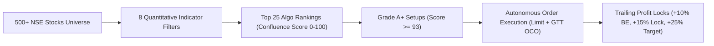

# QuantSentinel: The Complete Masterclass & System Architecture Guide
### *A Beginner-to-Advanced Guide to Quantitative Stock Market Trading, Indicators, and Algorithmic Execution*

---

> [!NOTE]
> **Who is this guide for?**
> This document is designed for **anyone**—from an absolute beginner with zero financial knowledge to an experienced market participant. It explains what the stock market is, why quantitative trading outperforms emotion-driven investing, and breaks down every single indicator and mathematical rule powering the **QuantSentinel** trading engine.

---

## Table of Contents
1. [Executive Summary: What is QuantSentinel?](#1-executive-summary-what-is-quantsentinel)
2. [Stock Market Fundamentals: How Price Actually Moves](#2-stock-market-fundamentals-how-price-actually-moves)
3. [The Psychology Trap: Why 95% of Retail Traders Lose Money](#3-the-psychology-trap-why-95-of-retail-traders-lose-money)
4. [The 8 Core Indicators of QuantSentinel (Deep Dive)](#4-the-8-core-indicators-of-quantsentinel-deep-dive)
   - [Indicator 1: 20 & 50 EMA (Stage 2 Trend Confirmation)](#indicator-1-20--50-ema-stage-2-trend-confirmation)
   - [Indicator 2: Relative Strength (RS Alpha vs Nifty 50)](#indicator-2-relative-strength-rs-alpha-vs-nifty-50)
   - [Indicator 3: Relative Volume (RVOL)](#indicator-3-relative-volume-rvol-the-institutional-footprint)
   - [Indicator 4: Relative Strength Index (RSI 14)](#indicator-4-relative-strength-index-rsi-14-the-goldilocks-zone)
   - [Indicator 5: 20-Day Resistance Breakout](#indicator-5-20-day-resistance-breakout-clearing-the-ceiling)
   - [Indicator 6: Close Location Value (CLV)](#indicator-6-close-location-value-clv-rejecting-fakeouts)
   - [Indicator 7: Average Directional Index (ADX 14)](#indicator-7-average-directional-index-adx-14-the-trend-accelerometer)
   - [Indicator 8: Extension Safety (Rubber Band Guard)](#indicator-8-extension-safety-the-rubber-band-guard)
5. [The Confluence Scoring Engine (0 to 100)](#5-the-confluence-scoring-engine-0-to-100)
6. [Risk Management & Asymmetric Payoffs ($1 : 5.2$)](#6-risk-management--asymmetric-payoffs-1--52)
7. [Algorithmic Trailing Profit Locks (Zero-Loss Defense)](#7-algorithmic-trailing-profit-locks-zero-loss-defense)
8. [The Complete Lifecycle of a QuantSentinel Trade](#8-the-complete-lifecycle-of-a-quantsentinel-trade)
9. [Quick Reference Cheat Sheet](#9-quick-reference-cheat-sheet)
10. [Glossary of Essential Terms](#10-glossary-of-essential-terms)

---

## 1. Executive Summary: What is QuantSentinel?

**QuantSentinel** is an autonomous, quantitative algorithmic trading desk designed specifically for the **Indian National Stock Exchange (NSE)**. 

Instead of relying on tips, news headlines, television anchors, or human emotions (fear, greed, hope, panic), QuantSentinel operates like an institutional hedge fund:
- **Massive Universe Scanning**: Every single evening after market close (15:30 IST), it systematically scans **500+ NSE stocks** (Large Cap, Mid Cap, and Small Cap).
- **Multi-Factor Confluence**: It passes each stock through **8 rigorous mathematical indicator models**. Over 99% of stocks fail these checks and are rejected.
- **Asymmetric Risk/Reward**: It only enters setups where the upside potential is at least **$5.2\times$ greater** than the downside risk (+25.0% profit target vs. -4.8% hard stop-loss).
- **Dynamic Protection**: It automatically trails stop-losses to **Breakeven** at +10% gain, and locks in **+8% guaranteed profit** at +15% gain, eliminating round-trip losses on winning trades.



---

## 2. Stock Market Fundamentals: How Price Actually Moves

To understand QuantSentinel, you must first understand the fundamental mechanics of the stock market.

### What is a Stock?
A stock (or share) represents partial ownership in a real-world corporation (like Tata Steel, Reliance Industries, or Infosys). When a company thrives, expands, and generates increasing cash flows, its perceived value rises.

### What Makes Stock Prices Move?
At any given second, stock prices move strictly according to the economic law of **Supply and Demand**:
- If more buyers want to purchase shares than sellers want to part with them, buyers must bid higher prices $\implies$ **Price goes up**.
- If more sellers want to dump shares than buyers want to absorb, sellers must lower their asking prices $\implies$ **Price goes down**.
- When buyers and sellers are equal, price moves sideways in a range $\implies$ **Consolidation / Chop**.

### The Anatomy of a Candlestick Bar
In daily swing trading, each day's trading action is represented by a **Candlestick Bar**, which records four critical price points (**OHLC**):
1. **Open (O)**: The price at which the first transaction occurred when the market opened at 09:15 AM.
2. **High (H)**: The highest price reached at any point during the day.
3. **Low (L)**: The lowest price reached at any point during the day.
4. **Close (C)**: The final settled price when the market closed at 15:30 PM.

```
       High (Highest price of the day)
        │
    ┌───┴───┐
    │       │
    │ Body  │  If Close > Open  ==> GREEN CANDLE (Buyers won the day)
    │       │  If Close < Open  ==> RED CANDLE   (Sellers won the day)
    └───┬───┘
        │
       Low  (Lowest price of the day)
```

The difference between the High and Low is the **Candle Range**. The difference between the Open and Close is the **Candle Body**. The thin lines above and below the body are called **Wicks (or Shadows)**.

### What is Volume?
**Volume** is the total number of shares bought and sold during that day. 
- *Why Volume is Critical*: Retail traders (individuals trading from their phones) trade hundreds or thousands of shares. Institutional giants (Mutual Funds, Foreign Institutional Investors / FIIs, Domestic Institutions / DIIs) trade **millions of shares**. 
- When an institution enters a stock, they cannot hide their footprints: the volume bar spikes dramatically. QuantSentinel tracks these institutional footprints.

---

## 3. The Psychology Trap: Why 95% of Retail Traders Lose Money

Extensive academic studies by financial regulators (including SEBI in India) reveal that over **90% to 95% of retail stock traders lose money**. Why does this happen?

| Retail Trader Flaw | How Retail Loses | How QuantSentinel Solves It |
| :--- | :--- | :--- |
| **FOMO (Fear of Missing Out)** | Buys stocks after they have already rallied 40% in a week, right before institutions dump. | **Extension Safety Indicator**: Rejects any stock more than 8% above its 20 EMA. |
| **Disposition Effect** | Cuts small winning trades at +3% out of fear, but holds losing trades at -20% hoping they come back. | **Asymmetric Risk/Reward**: Cuts losses strictly at -4.8%; lets winners run to +25.0%. |
| **Catching Falling Knives** | Buys dying stocks that crashed 50% because "they look cheap". | **Stage 2 Trend Confirmation**: Only buys stocks in strong, rising upward trends. |
| **Lack of Edge / Tips** | Buys based on WhatsApp groups, Telegram channels, and TV pundits. | **8-Factor Mathematical Confluence**: Requires objective quantitative confirmation. |
| **Emotional Exhaustion** | Panics during intraday red candles and sells at the exact bottom. | **Automated GTT Bracket Orders**: Execution rules are locked in advance with zero emotion. |

---

## 4. The 8 Core Indicators of QuantSentinel (Deep Dive)

QuantSentinel evaluates every stock across **8 complementary indicator models**. Each indicator acts as a specialist filter examining a different dimension of market physics: Trend, Relative Strength, Volume, Momentum, Structure, Candlestick Pressure, Directional Velocity, and Extension Safety.

```
┌────────────────────────────────────────────────────────────────────────┐
│                   QUANTSENTINEL 8-INDICATOR MATRIX                    │
├───────────────────┬────────────────────────────────────────────────────┤
│ 1. Trend          │ 20 EMA > 50 EMA & Price >= 20 EMA (Stage 2)        │
│ 2. Alpha          │ Relative Strength Alpha >= +4.0% vs Nifty 50       │
│ 3. Volume         │ Relative Volume (RVOL) >= 1.90x 20-Day Average     │
│ 4. Momentum       │ 14-Day RSI in Sweet Spot (52.0 - 72.5)             │
│ 5. Structure      │ 20-Day Resistance High Breakout (Within 1.5%)      │
│ 6. Pressure       │ Close Location Value (CLV) >= 68% (Upper Wick Trap)│
│ 7. Velocity       │ ADX >= 20.0 (Confirmed Directional Trend)         │
│ 8. Safety         │ <= 8.0% Above 20 EMA (No Parabolic Chasing)        │
└───────────────────┴────────────────────────────────────────────────────┘
```

---

### Indicator 1: 20 & 50 EMA (Stage 2 Trend Confirmation)

#### Plain English Analogy
*Imagine swimming in a river. If you swim with the current, you glide effortlessly. If you try to swim against the current, you exhaust yourself and drown. The Moving Average represents the current of the river.*

#### What is an EMA?
An **Exponential Moving Average (EMA)** calculates the average closing price of a stock over a set number of days, but gives **exponentially higher weight to recent days**. 
- A **20 EMA** reflects the short-term institutional trend (approximately 1 month of trading days).
- A **50 EMA** reflects the medium-term structural trend (approximately 2.5 months of trading days).

```python
# Mathematical Concept
Multiplier = 2 / (Period + 1)
EMA_Today = (Price_Today * Multiplier) + (EMA_Yesterday * (1 - Multiplier))
```

#### Why We Use It (The Rationale)
According to classic market cycle theory (Stan Weinstein's Stage Analysis), stocks cycle through 4 stages:
1. *Stage 1*: Basing / Accumulation (Sideways)
2. *Stage 2*: **Advancing Phase (Strong Uptrend)** $\leftarrow$ *QuantSentinel only trades here*
3. *Stage 3*: Distribution / Top (Sideways churn)
4. *Stage 4*: Declining Phase (Downtrend crash)

When a stock's current price is above its 20 EMA, and its 20 EMA is comfortably above its 50 EMA and rising, the stock is in a confirmed **Stage 2 Uptrend**.

#### QuantSentinel Thresholds
- **Current Close $\ge$ 20 EMA**
- **20 EMA $\ge$ 50 EMA $\times 1.01$** (at least 1% clearance)
- **Slope of 20 EMA $> 0$** (must be pointing upward over the past 5 sessions)
- **Slope of 50 EMA $\ge 0$** (must not be sloping downward)

#### The Goal
**To eliminate falling knives.** This indicator guarantees that QuantSentinel will never buy a stock that is crashing, stagnating, or stuck in a downtrend.

---

### Indicator 2: Relative Strength (RS Alpha vs Nifty 50)

#### Plain English Analogy
*Imagine two racehorses. On a calm day, both run well. But when a fierce headwind starts blowing, Horse A slows down by 10%, while Horse B powers forward and gains 15% speed. Horse B possesses genuine, elite strength.*

#### What is RS Alpha?
Relative Strength (not to be confused with RSI) measures **how much a stock is outperforming the broader benchmark index (Nifty 50)** over a rolling 20-day window (1 calendar month).

$$\text{Stock Return}_{20d} = \frac{\text{Price}_{\text{today}} - \text{Price}_{20d\text{ ago}}}{\text{Price}_{20d\text{ ago}}}$$

$$\text{Nifty Return}_{20d} = \frac{\text{Nifty}_{\text{today}} - \text{Nifty}_{20d\text{ ago}}}{\text{Nifty}_{20d\text{ ago}}}$$

$$\text{RS Alpha} = (\text{Stock Return}_{20d} - \text{Nifty Return}_{20d}) \times 100$$

#### Why We Use It (The Rationale)
When the overall market (Nifty 50) drops by -2%, but a stock rises +3%, big institutional funds are actively accumulating that stock despite market fear. When the broader market finally rebounds, these "Relative Strength Leaders" explode higher with massive momentum.

#### QuantSentinel Thresholds
- **RS Alpha $\ge +4.0\%$**: The stock must have beaten the Nifty 50 index by at least 4.0% over the last 20 trading sessions.
- *Bonus Weight*: If Alpha $\ge +8.0\%$, the stock is awarded additional confluence score points.
- *Rejection*: If Alpha is negative (meaning the stock is lagging behind the market), score points are heavily penalized.

#### The Goal
**To buy only market leaders, never laggards.** We want the strongest horse in the race, not the cheapest one.

---

### Indicator 3: Relative Volume (RVOL) — The Institutional Footprint

#### Plain English Analogy
*If you see ripples in a swimming pool, a child just jumped in. If you see tidal waves sloshing over the sides of the pool, an elephant just stepped into the water. Relative Volume detects the elephant.*

#### What is RVOL?
**Relative Volume (RVOL)** compares today's trading volume to the stock's average daily volume over the past 20 sessions:

$$\text{Average Volume}_{20d} = \frac{1}{20} \sum_{i=1}^{20} \text{Volume}_i$$

$$\text{RVOL} = \frac{\text{Today's Volume}}{\text{Average Volume}_{20d}}$$

- $\text{RVOL} = 1.0\times \implies$ Perfectly normal, ordinary trading volume.
- $\text{RVOL} = 0.5\times \implies$ Light, dormant volume (only retail traders).
- $\text{RVOL} \ge 1.9\times \implies$ **Huge institutional accumulation.**

#### Why We Use It (The Rationale)
Retail traders cannot generate double the average volume in a multi-billion rupee stock. A volume surge of $1.9\times$ or higher proves that domestic mutual funds, foreign hedge funds, or sovereign wealth funds are aggressive net buyers. 

A price breakout accompanied by high volume is far less likely to fail because institutional buyers have skin in the game and will defend their purchase price.

#### QuantSentinel Thresholds
- **RVOL $\ge 1.90\times$**: Today's volume must be at least **90% higher** than the 20-day moving average.
- *High-Conviction Threshold*: Breakouts with $\text{RVOL} \ge 3.0\times$ receive maximum institutional momentum ranking points.
- *Rejection*: Any breakout occurring on $\text{RVOL} < 1.0\times$ is rejected as a "low-volume fakeout".

#### The Goal
**To ensure institutional sponsorship.** We only trade when the biggest money in the market is pushing the price in our direction.

---

### Indicator 4: Relative Strength Index (RSI 14) — The "Goldilocks" Zone

#### Plain English Analogy
*Think of the engine RPM in a sports car. If the RPM is at 1,000, the car is idling in neutral and going nowhere. If the RPM is at 8,500, the engine is redlining and about to overheat. The sweet spot is 5,500 RPM—maximum power output without blowing the engine.*

#### What is RSI?
The **Relative Strength Index (RSI)**, developed by J. Welles Wilder, is a momentum oscillator measured on a scale of **0 to 100**. It calculates the ratio of average upward price movement to average downward price movement over 14 trading days:

$$\text{RS} = \frac{\text{Average Gain over 14 days}}{\text{Average Loss over 14 days}}$$

$$\text{RSI} = 100 - \left( \frac{100}{1 + \text{RS}} \right)$$

- $\text{RSI} < 30 \implies$ "Oversold" (weak, depressed momentum).
- $\text{RSI} > 75 \implies$ "Overbought" (climax euphoria, highly vulnerable to profit taking).
- **$\text{RSI between } 52.0 \text{ and } 72.5 \implies$ The Institutional Momentum Sweet Spot.**

#### Why We Use It (The Rationale)
Traditional textbooks advise buying when RSI is below 30. In reality, stocks with RSI $< 30$ are usually broken companies experiencing severe distress. 

Conversely, strong momentum compounders initiate their biggest sustained moves when RSI crosses above 50 and powers into the 60s. However, once RSI exceeds 75, retail traders pile in with FOMO, creating a high-risk exhaustion climax where institutions dump their shares.

#### QuantSentinel Thresholds
- **Minimum RSI: $52.0$** (confirms bullish momentum has ignited).
- **Maximum RSI: $72.5$** (ensures price has not overheated).
- *Strict Hard Cap*: In live trade execution, any setup with $\text{RSI} > 76.5$ is strictly blocked to protect capital from exhaustion tops.

#### The Goal
**To enter during prime acceleration while avoiding overbought climax tops.**

---

### Indicator 5: 20-Day Resistance Breakout (Clearing the Ceiling)

#### Plain English Analogy
*Imagine bouncing a basketball under a concrete ceiling. Every time the ball hits the ceiling, it bounces back down. But if someone smashes the ceiling with a sledgehammer, the next bounce shoots straight into the open sky. A resistance breakout is smashing through that concrete ceiling.*

#### What is a 20-Day High Breakout?
A stock's **20-Day High** is the highest price recorded across the past 20 trading sessions (1 month). 
- If today's closing price exceeds that previous 20-day high $\implies$ **Bullish Breakout**.
- If today's price is within **1.5%** of that ceiling $\implies$ **Pre-Breakout Coil**.

```
Price (₹)
  120 ───────────────────────────── Concrete Resistance (20-Day High)
           /\          /\          ▲
          /  \        /  \        /│  ==> BREAKOUT OCCURS HERE!
         /    \      /    \      / │
  100 ──/──────\────/──────\────/──┴── Support Floor
```

#### Why We Use It (The Rationale)
Why is the previous high so significant? 
Because every investor who bought at that previous high was formerly trapped "in the red" as the price pulled back. When the price rallies back to that level, nervous investors often sell to "break even", creating resistance. 

When the price overcomes and closes above that level, **there are zero trapped overhead sellers left**. Every single person holding the stock is now in profit. Selling pressure vanishes, and price enters "blue sky territory" where it can run freely.

#### QuantSentinel Thresholds
- **Breakout Condition**: $\text{Close} \ge \text{Highest High of past 20 days}$, OR
- **Contraction Coil Condition**: $\text{Distance from 20-Day High} \le 1.5\%$.

#### The Goal
**To buy at the point of least resistance.** When overhead resistance is broken, price can travel the furthest distance in the shortest amount of time.

---

### Indicator 6: Close Location Value (CLV) — Rejecting Fakeouts

#### Plain English Analogy
*Imagine an army storming an enemy hill. By noon, they reach the summit. But by evening, the defenders push them all the way back down to the bottom. Did the army win the day? No. But if the army reaches the summit and holds the high ground at nightfall, they won decisive control.*

#### What is Close Location Value?
**Close Location Value (CLV)** evaluates where the stock closed within its intraday High-Low range on that specific day:

$$\text{CLV} = \frac{\text{Close} - \text{Low}}{\text{High} - \text{Low}}$$

The result is expressed between $0.0$ and $1.0$ (or 0% to 100%):
- $\text{CLV} = 1.0\ (100\%) \implies$ Price closed at the exact absolute high of the day.
- $\text{CLV} = 0.5\ (50\%) \implies$ Price closed right in the middle of its daily range.
- $\text{CLV} = 0.0\ (0\%) \implies$ Price closed at the dead low of the day.

```
High  ────────────────  100%
                        │      ==> CLV >= 68% (Upper Range Close)
                        │          (Institutional Buyers in Complete Control)
      ────────────────  68%
                        │
                        │      ==> CLV < 50% (Weak Close / Long Upper Wick)
                        │          (Sellers Dumped Into Retail Buyers)
Low   ────────────────  0%
```

#### Why We Use It (The Rationale)
One of the most dangerous traps for retail traders is the **"Upper-Wick Fakeout"** (or Shooting Star). A stock spikes up +5% at 10:00 AM. Retail traders rush to buy on excitement. But institutional sellers use that liquidity to dump their shares, driving the price back down to close near the low of the day.

If $\text{CLV} \ge 68\%$, it mathematically proves that buyers completely dominated sellers and held their gains into the final closing bell at 15:30 PM.

#### QuantSentinel Thresholds
- **Indicator Benchmark**: $\text{CLV} \ge 0.68\ (68\%)$.
- **Execution Hard Filter**: $\text{CLV}$ must be $\ge 0.64\ (64\%)$ on breakout day.
- **Intraday Candle Guard**: The breakout candle must be green ($\text{Close} \ge \text{Open}$).

#### The Goal
**To eliminate bull traps and upper-wick selling traps.** We only buy when buyers maintain relentless pressure into the close.

---

### Indicator 7: Average Directional Index (ADX 14) — The Trend Accelerometer

#### Plain English Analogy
*Moving averages tell you which direction a car is traveling (North or South). The ADX tells you whether the driver is pressing the accelerator pedal to the floor or tapping the brakes. ADX measures horsepower.*

#### What is ADX?
The **Average Directional Index (ADX)**, also created by J. Welles Wilder, measures the **strength of a trend**, completely regardless of whether the trend is up or down:
- It uses Directional Movement Indicators ($+\text{DI}$ and $-\text{DI}$) to evaluate the expansion of daily price ranges.
- $\text{ADX} < 20 \implies$ Weak, absent trend (sideways consolidation, choppy noise).
- $\text{ADX} \ge 20 \implies$ **A confirmed, powerful directional trend has ignited.**
- $\text{ADX} \ge 25 \implies$ Strong, rapid trend velocity.

#### Why We Use It (The Rationale)
Stocks spend roughly 70% of their time in choppy, directionless consolidations. If you buy during these periods, your capital sits dead for months with zero return, or gets chopped up by false starts. 

When ADX crosses above 20, it confirms that the stock has transitioned from dormant chop into active, high-velocity trending motion.

#### QuantSentinel Thresholds
- **ADX $\ge 20.0$**: Minimum requirement for trend strength.
- *Bonus Weight*: If $\text{ADX} \ge 25.0$, additional confluence points are awarded.

#### The Goal
**To avoid dead money in sideways consolidations.** We only deploy capital when price velocity is actively expanding.

---

### Indicator 8: Extension Safety (The Rubber Band Guard)

#### Plain English Analogy
*If you take a rubber band and pull it back 2 inches, it has tension. If you pull it back 12 inches, it is stretched to its absolute physical limit and will violently snap back to your hand. Moving averages act like that hand; price is the rubber band.*

#### What is Extension?
**Extension** measures how far the current price has stretched away from its baseline 20 EMA:

$$\text{Extension} = \left( \frac{\text{Current Close} - 20\text{ EMA}}{20\text{ EMA}} \right) \times 100$$

$$\text{10-Day Momentum Return} = \frac{\text{Current Close} - \text{Close}_{10d\text{ ago}}}{\text{Close}_{10d\text{ ago}}}$$

#### Why We Use It (The Rationale)
When an attractive company reports good news, retail traders chase it higher day after day. By day 6, the stock might be 15% or 20% above its 20 EMA. 

Even if all other indicators look bullish, buying an over-extended stock is financial suicide: mean-reversion is mathematically inevitable. A healthy pullback of just 5% will trigger a normal stop-loss, stopping you out right before the stock resumes its climb.

#### QuantSentinel Thresholds
- **Distance from 20 EMA**: Must be between **$-1.0\%$ and $+8.0\%$**.
- **10-Day Momentum Cap**: Price must not have risen more than **$+18\%$ in the last 10 days**.
- *Hard Rejection*: Any setup where price is $> 8.0\%$ above 20 EMA is marked as `EXTENDED` and rejected.

#### The Goal
**To prevent FOMO chasing.** QuantSentinel only buys tight, controlled breakouts from proper bases, never parabolic spikes.

---

## 5. The Confluence Scoring Engine (0 to 100)

Having individual indicators is useful, but the real secret of institutional quant trading is **Confluence**: combining all 8 indicators into a single weighted score from **0 to 100**.

### Scoring Weights Hierarchy

```
Base Stage 2 Setup Identified:
  ├─ Bullish Breakout + Trend + RVOL + RSI + CLV satisfied  ==> Base Score: 88
  ├─ Trend + Breakout + RS Alpha satisfied                  ==> Base Score: 76
  ├─ Trend + (RS Alpha OR RVOL) satisfied                   ==> Base Score: 65
  └─ Trend only satisfied                                   ==> Base Score: 55

Multi-Factor Bonus Adjustments:
  ├─ RS Alpha >= +8.0%  ==> +9 pts   (Alpha >= +4.0% ==> +6 pts)
  ├─ RVOL >= 3.0x       ==> +9 pts   (RVOL >= 2.0x   ==> +6 pts)
  ├─ 20 EMA Slope > 0.05 ==> +5 pts
  ├─ CLV >= 70%         ==> +4 pts   (CLV < 45%      ==> -4 pts penalty)
  ├─ Safe Extension (1% - 7.5% from EMA20) ==> +5 pts
  ├─ Dangerous Extension (> 11% from EMA20) ==> -6 pts penalty
  ├─ ADX >= 25.0        ==> +4 pts
  └─ Solid Green Candle (+1.4% move & Close >= Open) ==> +4 pts
```

### Setup Grading System

| Confluence Score | Conviction Grade | Algo Signal | Capital Allocation | Description |
| :---: | :---: | :---: | :---: | :--- |
| **93 – 99** | **Grade A+** | **STRONG BUY** | **15.0% of Portfolio** | Elite institutional setups with clean breakout, heavy volume surge, and high relative strength. |
| **80 – 92** | **Grade A** | **BUY SETUP** | **12.5% of Portfolio** | High-probability continuation setups meeting all primary trend and momentum criteria. |
| **60 – 79** | **Grade B** | **ACCUMULATE** | *Watchlist Only* | Valid setups with 1 or 2 minor criteria pending (e.g. awaiting breakout high). |
| **< 60** | **Grade C / D** | **AVOID / WAIT** | *Zero Allocation* | Choppy, extended, or weak setups rejected by the filter. |

---

## 6. Risk Management & Asymmetric Payoffs ($1 : 5.2$)

Most beginner traders believe that winning in the market requires having an 80% or 90% win rate. **This is completely false.** 

World-class hedge funds (like Renaissance Technologies or Stanley Druckenmiller) often have win rates between 50% and 60%. They generate fortunes because of **Asymmetric Payoffs**: when they lose, they lose pennies; when they win, they make dollars.

### The QuantSentinel Risk Formula

$$\text{Hard Initial Stop Loss} = \text{Entry Price} \times (1 - 0.048) \implies \mathbf{-4.8\%}$$

$$\text{Algorithmic Profit Target} = \text{Entry Price} \times (1 + 0.250) \implies \mathbf{+25.0\%}$$

$$\text{Risk / Reward Ratio} = \frac{+25.0\%}{4.8\%} = \mathbf{5.21 : 1}$$

```
Risk ₹1.00  ──►  Target ₹5.21
[====]           [================================================]
```

### The Math of Profitability
Let's see what happens over **100 trades** with an ordinary **55% win rate** using QuantSentinel's exact risk parameters on a ₹10,00,000 portfolio:

- **55 Winning Trades** $\times$ ₹25,000 gain = **+₹13,75,000**
- **45 Losing Trades** $\times$ ₹4,800 loss = **-₹2,16,000**
- **Net Net Profit** = **+₹11,59,000 (+115.9% Portfolio Growth)**

Because our winners are **$5.2\times$ larger than our losers**, you could lose 7 out of every 10 trades and still make money!

---

## 7. Algorithmic Trailing Profit Locks (Zero-Loss Defense)

A major psychological frustration for traders is watching a stock gain +12%, fail to hit the final target, reverse, and turn into a painful -5% loss. 

QuantSentinel completely eliminates this problem with its **Three-Tier Trailing Profit Lock System**:

```
Trade Progression:
 
 0% Entry ─────────► +10% Gain ─────────────► +15% Gain ─────────────► +25% Target
   │                   │                        │                        │
   ▼                   ▼                        ▼                        ▼
Initial Stop Loss    Stop Loss Trailed        Stop Loss Trailed        Full Profit Booked
   [-4.8%]            to BREAKEVEN [0%]       to LOCK PROFIT [+8%]     [+25.0% GAIN]
 (Max Downside Risk)  (Zero Risk Remaining)   (Guaranteed Winning Trade)(Mission Accomplished)
```

1. **Tier 1 (Initial Entry)**: 
   - Stop Loss is set at **$-4.8\%$** below entry price. 
   - Capital is strictly protected.
2. **Tier 2 (The Breakeven Lock at $+10\%$ Gain)**:
   - When the stock reaches **$+10.0\%$** unrealized profit, the engine automatically moves the Stop Loss to **$\text{Entry Price} \times 1.00$ (Breakeven)**.
   - The trade is now **100% Risk-Free**. Worst case scenario: you get out at zero loss.
3. **Tier 3 (The Profit Lock at $+15\%$ Gain)**:
   - When the stock reaches **$+15.0\%$** unrealized profit, the engine trails the Stop Loss upward to lock in **$+8.0\%$ guaranteed net profit**.
   - Even if the company CEO resigns or a black-swan event hits the market overnight, you walk away with a guaranteed +8% profit.
4. **Tier 4 (Final Target at $+25\%$ Gain)**:
   - When price touches **$+25.0\%$**, the full position is liquidated into cash, locking in the capital gains and freeing up money for the next trade.

### Sector Concentration Defense
To prevent correlation meltdowns (such as an IT sector crash or a Banking crisis hitting multiple positions at once), QuantSentinel enforces strict portfolio rules:
- **Maximum 2 positions per sector**.
- **The Risk-Free Prerequisite**: A 2nd position in any sector is **strictly forbidden** until the 1st position's Stop Loss has been successfully moved to Breakeven or profit lock.

---

## 8. The Complete Lifecycle of a QuantSentinel Trade

Here is how a real-world trade executes from start to finish:

```mermaid
sequenceDiagram
    participant User as Trader / Dashboard
    participant QS as QuantSentinel Engine
    participant NSE as NSE Market Data Feed
    participant Broker as Broker Terminal (Zerodha/Groww)

    Note over User,Broker: 1. EVENING SCAN (15:45 IST)
    QS->>NSE: Fetch Daily OHLCV for 500+ Assets
    NSE-->>QS: Real Market Bars Returned
    QS->>QS: Compute 8 Indicators & Confluence Score
    QS->>User: Display Top 25 Ranked Setups

    Note over User,Broker: 2. SETUP QUALIFICATION & SIMULATION
    User->>QS: Click "Order Ticket" on #1 Ranked Stock (Score >= 93)
    QS->>User: Display Exact Limit Price, Stop Loss (-4.8%), Target (+25%) & Qty
    User->>Broker: Place GTT OCO Limit Order before 09:15 AM

    Note over User,Broker: 3. MARKET OPEN & TRADE MANAGEMENT
    NSE->>Broker: Market Opens at 09:15 AM; Limit Price Triggered
    Broker->>User: Buy Order Executed; SL Active at -4.8%
    NSE->>QS: Day 3: Stock Rallies to +10.5%
    QS->>User: Trailing SL Triggered -> Move SL to Breakeven (0% Risk)
    NSE->>QS: Day 7: Stock Rallies to +16.2%
    QS->>User: Trailing SL Triggered -> Lock In +8.0% Guaranteed Profit
    NSE->>Broker: Day 12: Stock Touches +25.0% Target Price
    Broker->>User: GTT Target Triggered -> Sold at +25% Full Profit!
```

---

## 9. Quick Reference Cheat Sheet

| Indicator | Code Key | Formula / Basis | Exact QuantSentinel Threshold | What It Prevents |
| :--- | :---: | :--- | :--- | :--- |
| **Stage 2 Trend** | `trend` | $\text{Price} \ge \text{EMA20} > \text{EMA50}$ | $20 \text{ EMA} \ge 50 \text{ EMA} \times 1.01$, rising slope | Falling knives & downtrends |
| **Relative Strength** | `rs` | $\text{Stock Return}_{20d} - \text{Nifty Return}_{20d}$ | $\text{Alpha} \ge +4.0\%$ vs Nifty 50 | Slow, lagging stocks |
| **Relative Volume** | `rvol` | $\text{Volume} / \text{Volume SMA}_{20d}$ | $\text{RVOL} \ge 1.90\times$ (near double avg) | Low-volume false breakouts |
| **RSI Momentum** | `rsi` | 14-period Wilder Momentum | $52.0 \le \text{RSI} \le 72.5$ | Weak chop ($<52$) & climax tops ($>75$) |
| **20D Breakout** | `breakout`| Resistance ceiling penetration | $\text{New 20D High}$ or within $1.5\%$ | Overhead supply resistance traps |
| **CLV Pressure** | `clv` | $(\text{Close} - \text{Low}) / (\text{High} - \text{Low})$ | $\text{CLV} \ge 68\%$ ($0.68$), Green candle | Intraday dump / Upper-wick traps |
| **ADX Velocity** | `adx` | Directional Movement Index | $\text{ADX} \ge 20.0$ | Flat, sideways, dormant markets |
| **Extension Safety**| `safety` | $(\text{Close} - \text{EMA20}) / \text{EMA20}$ | $\le 8.0\%$ from 20 EMA, 10d return $\le 18\%$ | FOMO buying parabolic spikes |

---

## 10. Glossary of Essential Terms

- **Benchmark Index**: A broad basket of premier stocks representing the overall health of the country's economy (e.g. **Nifty 50** in India, representing the 50 largest companies).
- **Stage 2 Uptrend**: A sustained period of months where a stock consistently makes higher highs and higher lows, guided above its 20 and 50 EMAs.
- **Bullish**: Expecting prices to rise. (Derived from a bull thrusting its horns upward).
- **Bearish**: Expecting prices to fall. (Derived from a bear swiping its paws downward).
- **Stop Loss (SL)**: An automated order placed with a broker to sell a stock if it drops to a specified price, capping the maximum possible loss.
- **Limit Order**: An order to buy or sell a stock only at a specified price or better, ensuring you never pay more than you intended.
- **GTT (Good-Till-Triggered)**: An advanced broker order type (available on Zerodha Kite, Groww, AngelOne) that stays active in the exchange system for up to a year until your exact price target or stop loss is reached.
- **OCO (One-Cancels-Other)**: A dual bracket order linking your Stop Loss and Profit Target. When one is hit, the other is automatically cancelled.
- **Drawdown**: The percentage decline in a portfolio's total value from its highest peak to its lowest trough during a trading period.
- **CAGR (Compound Annual Growth Rate)**: The annual rate of return earned on an investment over multiple years, taking into account the snowball effect of compounding gains.
- **Confluence**: The simultaneous alignment of multiple independent indicators giving the same buy signal at the exact same moment.

---

*QuantSentinel Trading System — Developed with Precision Quantitative Rules for the Indian Stock Market.*
